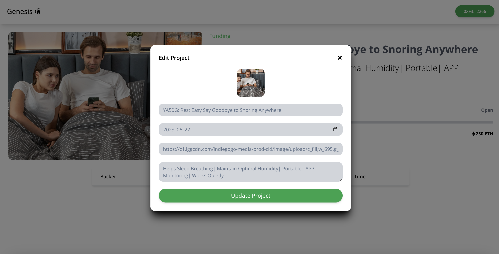

# CrowdFunding Application using Blockchain

Blockchain-powered fundraising projects offer a solution for creators who need to commit substantial amounts of resources, time and money into developing ideas, products or services. Fundraisers allow organizations to test new products to measure market acceptance and viability before committing funds to further development. This market knowledge makes creators more willing to take on the financial risk to produce material that could benefit themselves or others. Without these assurances, creators may never get some of these products off the ground.

Three scenarios of blockchain crowdfunding terms: -

1. Once the entire product is created, published and accepted by the majority of the donors through a governance voting system, the complete funds are released to the creators.
2. When each milestone is reached and accepted by a predefined ratio of supporters, then a portion of the funds is released to facilitate project progress.
3. When the product is created and released to the public, the funds can be released to the creator with or without donor acceptance independent of donor acceptance levels.

The architecture of our project below: -


There are some screenshots of what we have made: -


<center><figcaption>Add Project</figcaption></center></br>


<center><figcaption>Delete Project</figcaption></center></br>


<center><figcaption>Donations for Project</figcaption></center></br>



<center><figcaption>Edit Project</figcaption></center></br>


<center><figcaption>Project Interface</figcaption></center></br>


<center><figcaption>Pay Fund For Project Project</figcaption></center></br>


<center><figcaption>Project Description</figcaption></center></br>

## Technology

This demo uses:

- Metamask
- Hardhat
- Infuria
- ReactJs
- Tailwind CSS
- CometChat
- Solidity
- EthersJs
- Faucet

## Running the demo

To run the demo follow these steps:

1. Clone the project with the code below.

   ```sh

   # Make sure you have the above prerequisites installed already!
   git clone https://github.com/Daltonic/genesis PROJECT_NAME
   cd PROJECT_NAME # Navigate to the new folder.
   yarn install # Installs all the dependencies.
   ```

2. Create an Infuria project, copy and paste your key in the spaces below.
3. Update the `.env` file with the following details.

   ```sh
   ENDPOINT_URL=<RPC_URL>
   SECRET_KEY=<SECRET_PHRASE>
   DEPLOYER_KEY=<YOUR_PRIVATE_KEY>
   ```

4. Run the app using `npm start`
   <br/>

## Useful links

- ⚽ [Metamask](https://metamask.io/)
- 🚀 [Remix Editor](https://remix.ethereum.org/)
- 💡 [Hardhat](https://hardhat.org/)
- 📈 [Infuria](https://infura.io/)
- 🔥 [ReactJs](https://reactjs.org/)
- 🐻 [Solidity](https://soliditylang.org/)
- 👀 [EthersJs](https://docs.ethers.io/v5/)
- 🎅 [Faucet](https://faucets.chain.link/rinkeby)

Made by: -

Name - NISCHAY CHIB</br>
Student Id - 101427909

</br>
Name - VISHAL PAWAR</br>
Student Id - 101378105
